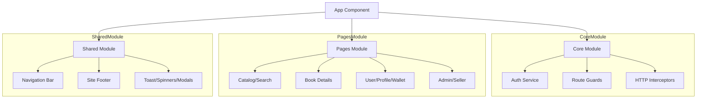

# 📚 BookNest Frontend — Modern Angular Web App
<p align="center">
  <a href="https://angular.io" target="_blank">
    
  </a>

  <a href="https://rxjs.dev" target="_blank">
    
  </a>

  <a href="https://www.typescriptlang.org" target="_blank">
    
  </a>

  <a href="https://material.angular.io/" target="_blank">
    
  </a>
</p>

<p align="center">
  <b>A high-performance, scalable, and modern Angular application for seamless book discovery and management.</b>
</p>

---

## ✨ Overview

**BookNest Frontend** is a feature-rich Angular application designed to deliver a **smooth, responsive, and intuitive user experience**.  
It connects users to a powerful backend ecosystem, enabling **book browsing, purchasing, and management** with real-time interactions.

---

## 🌟 Features

### 🧭 User Experience
- 🏠 Dynamic homepage with featured books & recommendations  
- 🔍 Real-time search with filters (category, price, rating)  
- 📱 Fully responsive design  

### 🛒 Commerce & Transactions
- 🛍️ Smart cart with live validation  
- 💳 Seamless checkout flow  
- 💰 Integrated digital wallet  

### 👤 User Management
- 👤 Profile dashboard  
- 📦 Order history & tracking  
- ❤️ Wishlist management  

### 🛠️ Admin & Seller Tools
- 📊 Seller dashboard for inventory management  
- 🛡️ Admin panel for moderation & analytics  

### 🔔 System Features
- 🔔 Real-time notifications  
- ⚡ High-performance UI with optimized rendering  

---

## 🛠️ Project Structure

The application follows a modular architecture for better maintainability and scalability.



---

## 🚀 Technologies

| Technology | Purpose |
| :--- | :--- |
| **Angular** | Core framework for building the SPA. |
| **RxJS** | Reactive programming and state management. |
| **Vanilla CSS** | Custom, high-performance styling without heavy frameworks. |
| **Lucide Icons** | Modern and clean iconography. |
| **Angular Router** | Client-side navigation and lazy loading. |
| **Signals** | Modern Angular state reactivity. |

---

## 🚦 Getting Started

### Prerequisites
- [Node.js](https://nodejs.org/) (v18 or higher)
- [Angular CLI](https://angular.dev/tools/cli)

### Installation

1. **Clone the repository:**
   ```bash
   git clone https://github.com/your-repo/booknest.git
   cd booknest/Frontend/BookNest
   ```

2. **Install dependencies:**
   ```bash
   npm install
   ```

3. **Configure API Endpoints:**
   - Open `src/environments/environment.ts` (or relevant config file).
   - Ensure the API Gateway URL points to `http://localhost:8080/api/v1`.

4. **Run the application:**
   ```bash
   npm start
   ```
   Navigate to `http://localhost:4200/` in your browser.

---

## 📸 Application Preview

| Home Page | Catalog | Book Detail |
| :---: | :---: | :---: |
| 🏠 | 📚 | 📖 |
| *Stunning Hero Section* | *Grid/List Views* | *Rich Descriptions* |

---

## 🛡️ Role-Based Access

The frontend dynamically adjusts based on the user's role:
- **USER**: Can browse, purchase, and review books.
- **SELLER**: Can list new books and manage their inventory.
- **ADMIN**: Full system control, user management, and global book verification.

---

<p align="center">
  Designed with ✨ by the BookNest Frontend Team
</p>
